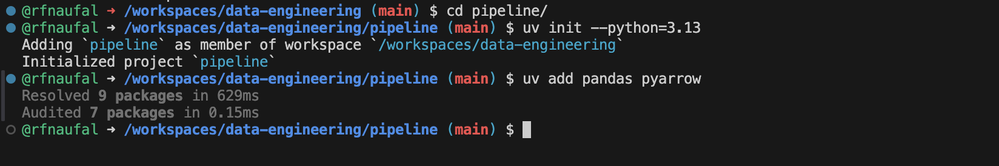
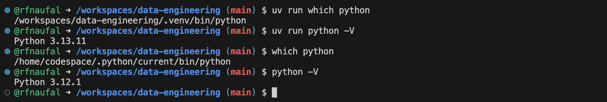
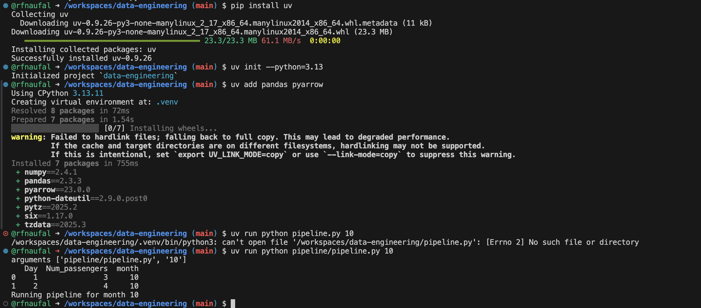

## Data Pipeline

### Install dependencies

This project requires pandas, but it isn’t included by default. If you want to run and test the code locally before using the container, you’ll need to install the required Python packages.

You can install them globally with pip:<br>
**pip install pandas pyarrow**

However, installing packages globally can lead to dependency conflicts—especially if other projects require different versions of the same libraries.

**Use a virtual environment** instead

#### UV

We strongly recommend using a virtual environment, which creates an isolated Python setup for this project and keeps dependencies separate from your system Python and other projects.

We’ll use uv, a modern and extremely fast Python package + project manager written in Rust. It’s significantly faster than pip and automatically manages virtual environments for your project.
> pip install uv

Initialize the project, ensure you are in the owrking directory to run these:

Create a new Python project using Python 3.13:
> uv init --python=3.13

This generates:

- pyproject.toml — project configuration and dependency management
- .python-version — pins the Python version for the project

Now let's add pandas:
> uv add pandas pyarrow

This adds pandas to your pyproject.toml and installs it in the virtual environment.
 <br>

Comparing python version
> uv run which python  # Python in the virtual environment <br>
> uv run python -V

> which python        # System Python <br>
> python -V 

 <br>

### Create simple Data Pipeline


Let's create an example pipeline. First, create a directory named pipeline and inside, create a file pipeline.py:
```python
import sys
import os
import pandas as pd
print("arguments", sys.argv)
month = int(sys.argv[1])

df = pd.DataFrame({"Day": [1, 2], "Num_passengers": [3, 4]})
df['month'] = month
print(df.head())
#df.to_parquet(f"output_day_{sys.argv[1]}.parquet")
df.to_parquet(f"{month}.parquet")
print(f"Running pipeline for month {month}")
print("cwd:", os.getcwd())
```

then run
> uv run python pipeline.py 10

 <br>

it will create 10.parquet file in working directory

as summary, here is the process from above script:
 <br>