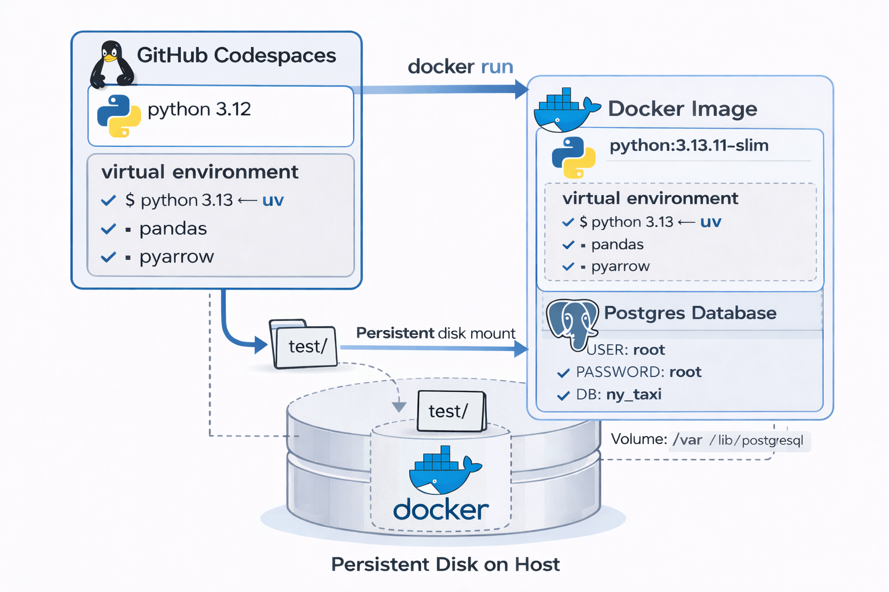
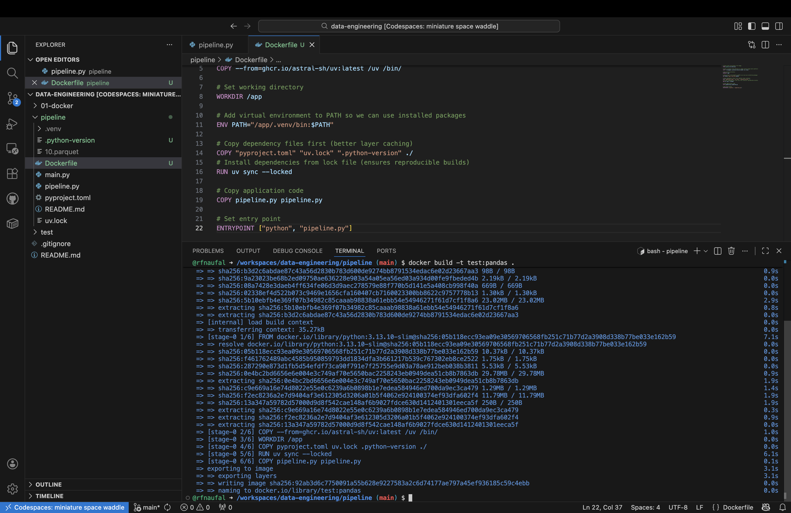
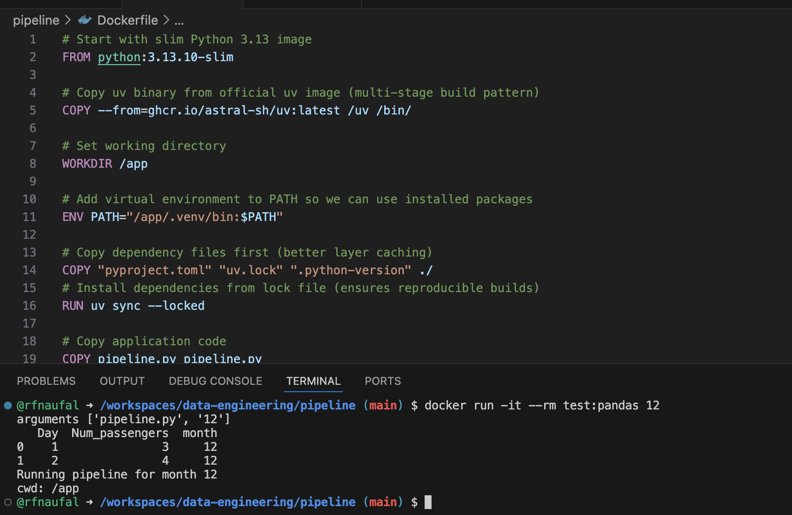
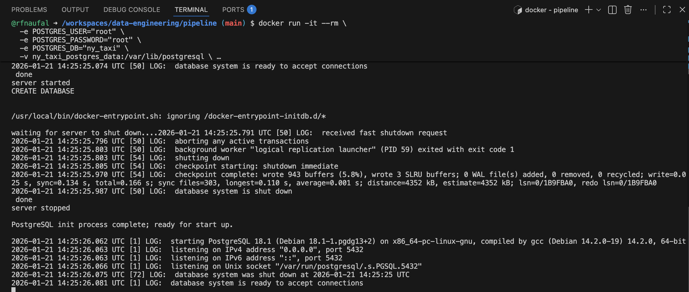
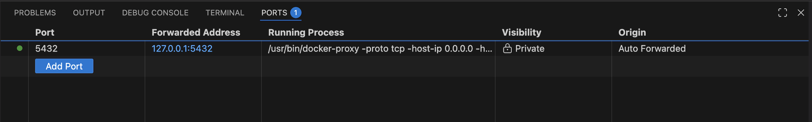
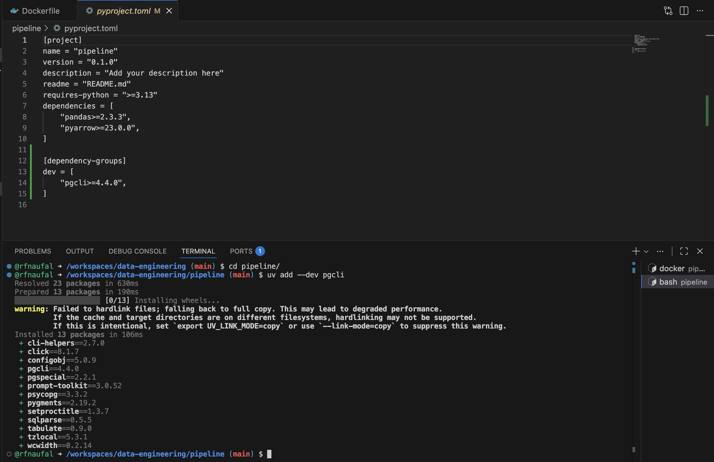

## Dockerizing a Data Pipeline App (Python + SQL)

### Architecture Overview

The diagram below illustrates the containerized workflow, where a Docker container runs a Python environment (managed with `uv`) and mounts a persistent host directory for data persistence. <br>
 <br>

### Dockerized Data Pipeline

Create the following Dockerfile file:

```bash
# Start with slim Python 3.13 image
FROM python:3.13.10-slim

# Copy uv binary from official uv image (multi-stage build pattern)
COPY --from=ghcr.io/astral-sh/uv:latest /uv /bin/

# Set working directory
WORKDIR /app

# Add virtual environment to PATH so we can use installed packages
ENV PATH="/app/.venv/bin:$PATH"

# Copy dependency files first (better layer caching)
COPY "pyproject.toml" "uv.lock" ".python-version" ./
# Install dependencies from lock file (ensures reproducible builds)
RUN uv sync --locked

# Copy application code
COPY pipeline.py pipeline.py

# Set entry point
ENTRYPOINT ["python", "pipeline.py"]

```

then build the image:

> docker build -t test:pandas .

 <br>

We can now run the container and pass an argument to it, so that our pipeline will receive it:

> docker run -it --rm test:pandas {some_number}

 <br>

### Dockerized PostgreSQL

```bash
docker run -it --rm \
  -e POSTGRES_USER="root" \
  -e POSTGRES_PASSWORD="root" \
  -e POSTGRES_DB="ny_taxi" \
  -v ny_taxi_postgres_data:/var/lib/postgresql \
  -p 5432:5432 \ 
  postgres:18
```

 <br>

 <br>

I open another terminal di working directory (pipeline), then run the command to install pgcli:

> uv add --dev pgcli

`--dev` flag marks this as a development dependency(not needed in production).

it will add below script in the pyproject.toml file instead of the main `dependencies` section.

```toml
[dependency-groups]
dev = [
    "pgcli>=4.4.0",
]
```

 <br>