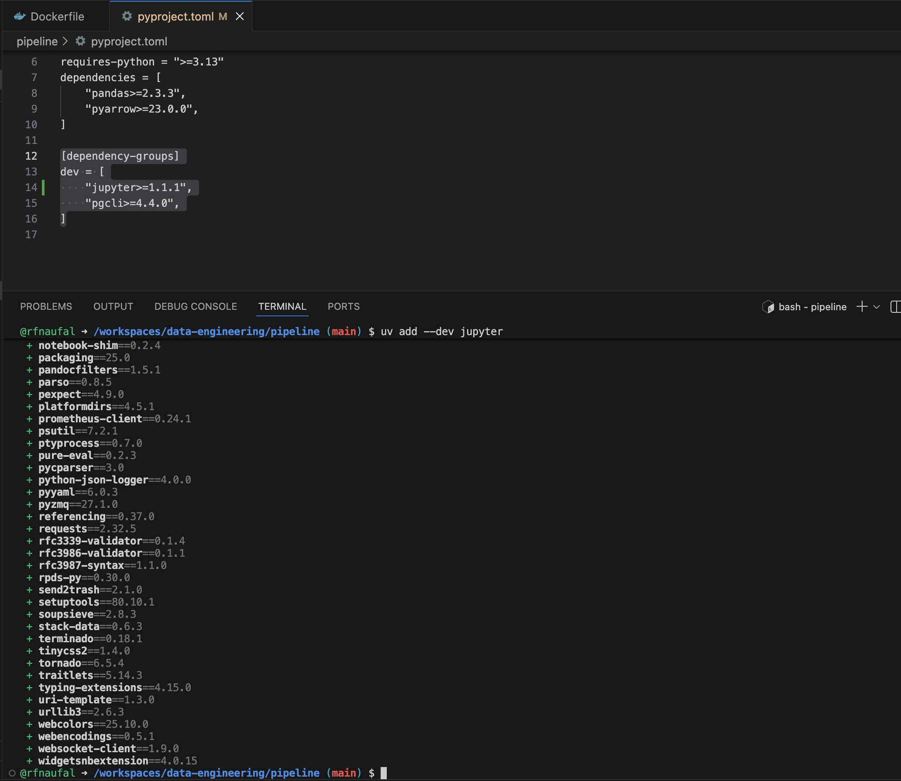

## Data Ingestion

#### Install Jupyter

Install Jupyter notebook in the docker host:

```bash
uv add --dev jupyter
```

it will add jupyter in the dependency-group

 <br>

```bash
uv run jupyter notebook
```

after runnning you will got the token, copy the token as shown below:

 <br>

click open the browser, or you also can access from PORTS tab next to TERMINAL.

Then, paste the token

 <br>
Now you can access working directory(pipeline folder) in the docker host through Jupyter

 <br>

### Use Case: NYC TLC Trip Record Dataset

We will use data from the NYC TLC Trip Record Data website.

Specifically, we will use the Yellow taxi trip records CSV file for January 2021.

This data used to be csv, but later they switched to parquet. We want to keep using CSV because we need to do a bit of extra pre-processing (for the purposes of learning it).

A dictionary to understand each field is available here.

> Note: The CSV data is stored as gzipped files. Pandas can read them directly.

#### Create Jupyter Notebook

We will now create a Jupyter Notebook notebook.ipynb file which we will use to read a CSV file and export it to Postgres.

then run:

```python
import pandas as pd

# Read a sample of the data
prefix = 'https://github.com/DataTalksClub/nyc-tlc-data/releases/download/yellow/'
df = pd.read_csv(prefix + 'yellow_tripdata_2021-01.csv.gz', nrows=100)

# Display first rows
df.head()

# Check data types
df.dtypes

# Check data shape
df.shape
```

We have warning here, because Pandas scanned the CSV and found that column index 6 (the 7th column) contains mixed data types.
e.g.:

- some rows look like numbers: 123

- other rows look like text: N/A, -, unknown

- or values have commas: 1,000

- or some rows empty → becomes NaN

So pandas can’t confidently decide the dtype (int, float, string), and warns you.

 <br>

I  use df.info() to quickly confirm:

- dtype problems

- missing values

- dataset shape

 <br>