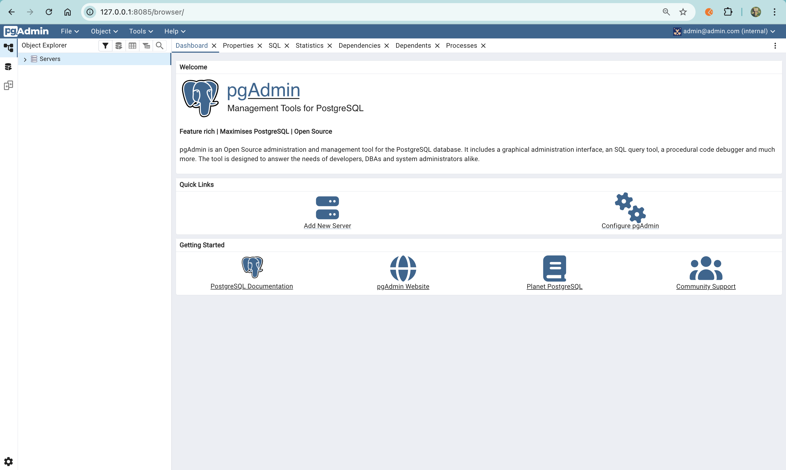

## PgAdmin

 <br>

### pgAdmin Container

```
docker run -it \
  -e PGADMIN_DEFAULT_EMAIL="admin@admin.com" \
  -e PGADMIN_DEFAULT_PASSWORD="root" \
  -v pgadmin_data:/var/lib/pgadmin \
  -p 8085:80 \
  --network=pg-network \
  --name pgadmin \
  dpage/pgadmin4
  ```

 <br>

 <br>

 <br>