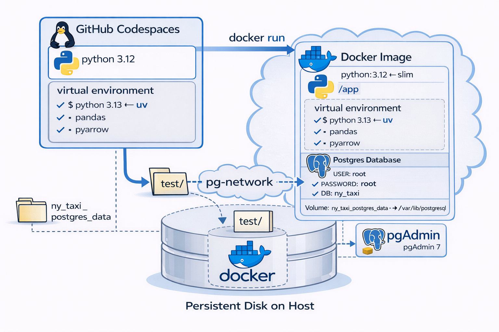
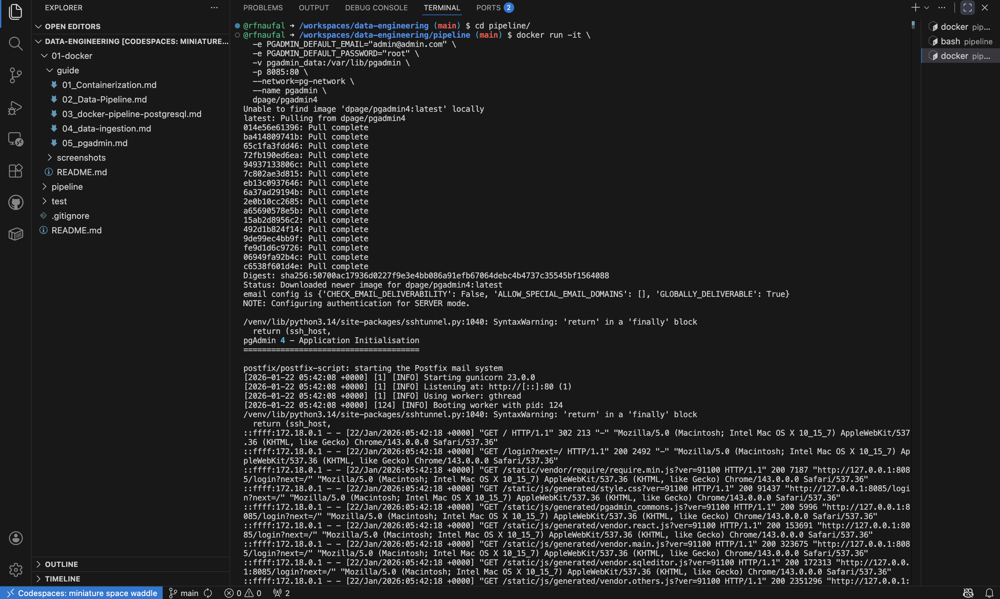
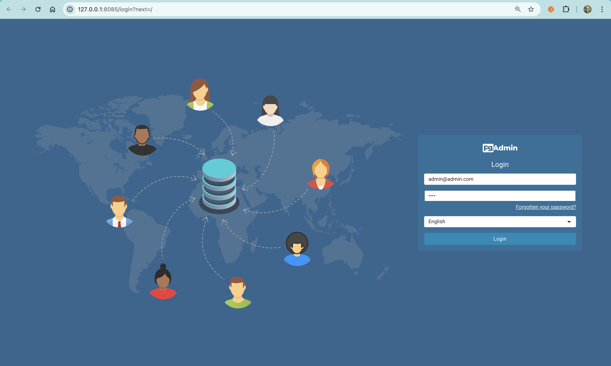
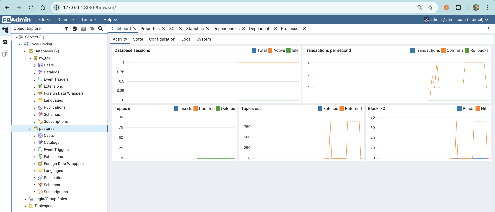

## PgAdmin - Database Management Tool

**pgAdmin** is a web-based GUI tool used to manage and explore **PostgreSQL databases**.  
Instead of using only terminal commands (`psql`), you can use pgAdmin to easily view tables, run SQL queries, monitor database activity, and manage users/databases through a visual interface.

 <br>

### pgAdmin Container

```sh
docker run -it \
  -e PGADMIN_DEFAULT_EMAIL="admin@admin.com" \
  -e PGADMIN_DEFAULT_PASSWORD="root" \
  -v pgadmin_data:/var/lib/pgadmin \
  -p 8085:80 \
  --network=pg-network \
  --name pgadmin \
  dpage/pgadmin4
```

 <br>

#### Connect pgAdmin to PostgreSQL

1. Open browser and go to http://localhost:8085

2. Login with:
   - Email: admin@admin.com
   - Password: root

3. Right-click Servers → Register → Server

4. Configure:
   - General tab
     - Name: Local Docker
   - Connection tab
     - Host: pgdatabase (the container name)
     - Port: 5432
     - Username: root
     - Password: root

5. Click Save

6. Now you can explore the database using the pgAdmin interface ✅

 <br>

 <br>

 <br>