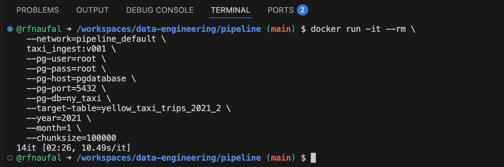
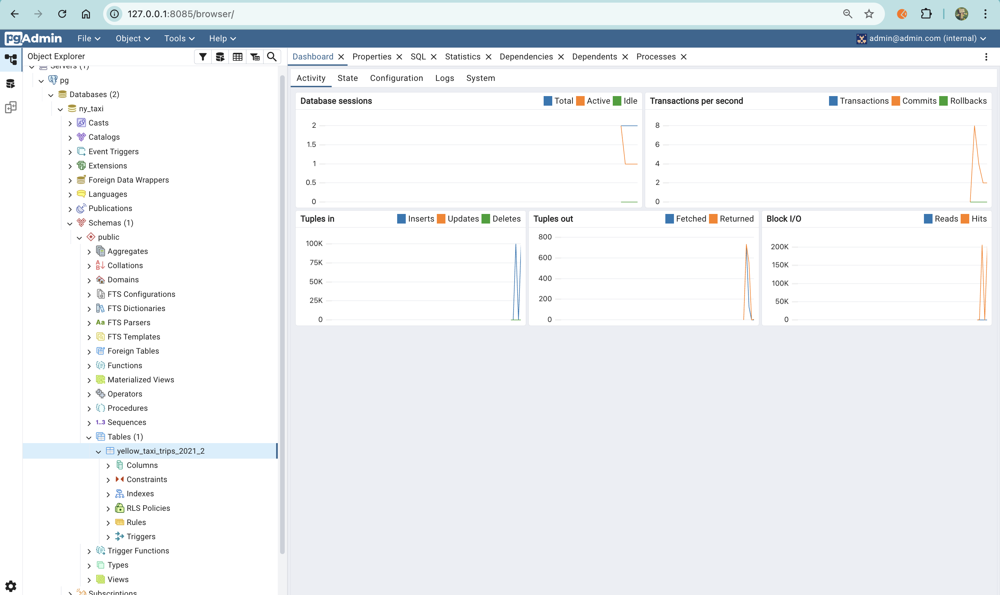

## Docker Compose

## Why Docker Compose?

Docker Compose is a tool that lets you define and run **multiple containers** as one application using a single `docker-compose.yml` file.

Instead of running long `docker run ...` commands for each service (like **PostgreSQL**, **pgAdmin**, and your **Python data pipeline app**), Compose makes it easy to:

- start everything with one command: `docker compose up`
- keep all settings in one place (ports, env vars, volumes, networks)
- ensure containers can talk to each other using service names (built-in DNS)
- persist data using volumes, so your database isn’t wiped when containers stop

In short: Docker Compose is the clean and repeatable way to run your whole data pipeline stack locally.

here is docker compose file:

```
services:
  pgdatabase:
    image: postgres:18
    environment:
      POSTGRES_USER: "root"
      POSTGRES_PASSWORD: "root"
      POSTGRES_DB: "ny_taxi"
    volumes:
      - "ny_taxi_postgres_data:/var/lib/postgresql"
    ports:
      - "5432:5432"

  pgadmin:
    image: dpage/pgadmin4
    environment:
      PGADMIN_DEFAULT_EMAIL: "admin@admin.com"
      PGADMIN_DEFAULT_PASSWORD: "root"
    volumes:
      - "pgadmin_data:/var/lib/pgadmin"
    ports:
      - "8085:80"


volumes:
  ny_taxi_postgres_data:
  pgadmin_data:
  ```

then run :
> docker compose up

We can validate that everything is working the same way as before.

 <br>

Docker Compose automatically creates a default network for that Compose project.

The name format is usually:

*<project_name>_default*

Since the folder / compose project name is pipeline, Docker will create:

**pipeline_default**

We will update the network of docker run command for ingestion script. 

change from pg-network to pipeline-default

```
docker run -it --rm \
  --network=pipeline_default \
  taxi_ingest:v001 \
  --pg-user=root \
  --pg-pass=root \
  --pg-host=pgdatabase \
  --pg-port=5432 \
  --pg-db=ny_taxi \
  --target-table=yellow_taxi_trips_2021_2 \
  --year=2021 \
  --month=1 \
  --chunksize=100000

```

 <br>

 <br>