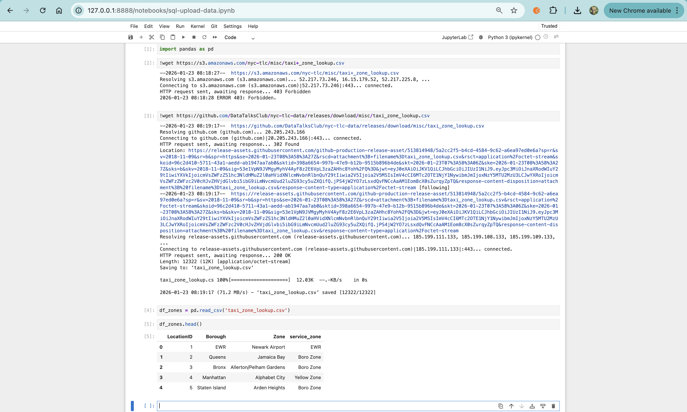
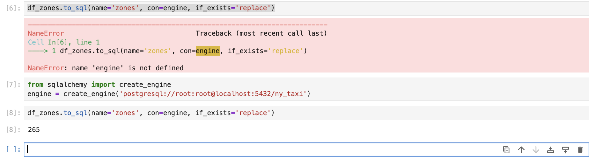
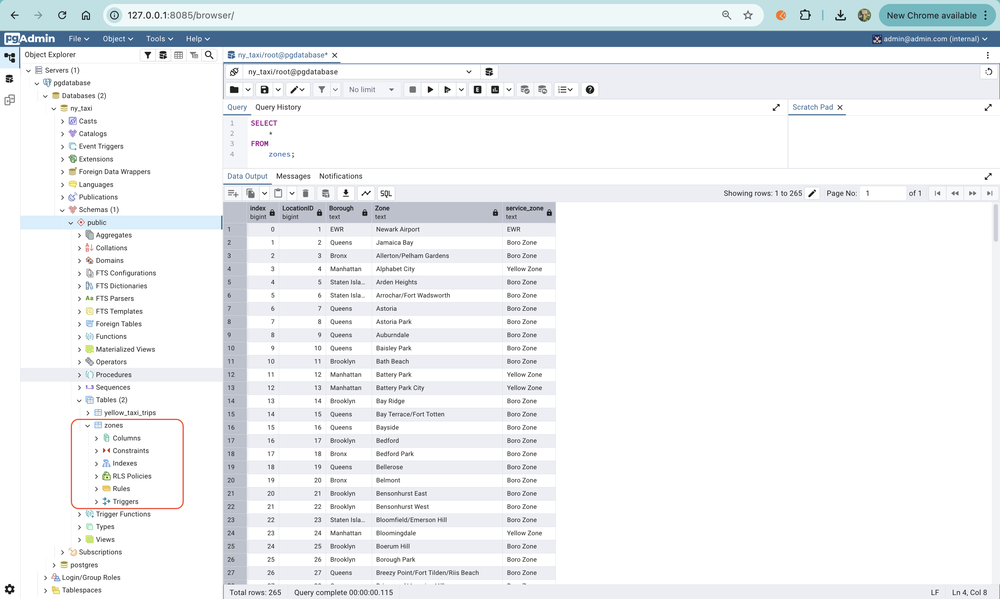

## SQL

We will convert data to sql:

https://github.com/DataTalksClub/nyc-tlc-data/releases/download/misc/taxi_zone_lookup.csv

### Create Jupyter Notebook

Create new jupyter notebook and follow previous steps:

`uv run jupyter notebook`

and also ingest the data by running taxi_ingest container.

 <br>

### Load CSV to Database

 <br>

When I tried to load the CSV file into the database, I encountered the error below.

It turns out SQLAlchemy is required.

 <br>

Note:

I already installed sqlsqlalchemy and psycopg2-binary in the previous steps

### Test Query

 <br>

### Inner Joins

An INNER JOIN combines two tables and returns only the rows that match in both tables based on a related column (key).

📌 Easy way to remember:

- INNER JOIN = keep only matching data
- ✅ Always use explicit JOIN (JOIN ... ON ...) in production / industry projects.
- ⚠️ Avoid implicit joins unless you're reading or maintaining legacy SQL.

| Join style                            | How it’s written                | Where join condition lives | Sample                                                                                             | Pros                                                  | Cons                                                           |
| ------------------------------------- | ------------------------------- | -------------------------- | -------------------------------------------------------------------------------------------------- | ----------------------------------------------------- | -------------------------------------------------------------- |
| **Implicit INNER JOIN** (old style)   | List tables separated by commas | `WHERE` clause             | `sql\nSELECT t.trip_id, z.Zone\nFROM trips t, zones z\nWHERE t.PULocationID = z.LocationID;\n`     | Short syntax                                          | Harder to read, easy to make mistakes, risky for large queries |
| **Explicit INNER JOIN** (recommended) | Use `JOIN ... ON ...`           | `ON` clause                | `sql\nSELECT t.trip_id, z.Zone\nFROM trips t\nJOIN zones z\n  ON t.PULocationID = z.LocationID;\n` | Clear, safe, easy to maintain, standard in modern SQL | Slightly longer syntax                                         |

#### Implicit Inner Joins

Joining Yellow Taxi table with Zones Lookup table

```sql
SELECT
    tpep_pickup_datetime,
    tpep_dropoff_datetime,
    total_amount,
    CONCAT(zpu."Borough", ' | ', zpu."Zone") AS "pickup_loc",
    CONCAT(zdo."Borough", ' | ', zdo."Zone") AS "dropoff_loc"
FROM
    yellow_taxi_trips t,
    zones zpu,
    zones zdo
WHERE
    t."PULocationID" = zpu."LocationID"
    AND t."DOLocationID" = zdo."LocationID"
LIMIT 100;

```

#### Explicit Inner Joins

```sql
SELECT
    tpep_pickup_datetime,
    tpep_dropoff_datetime,
    total_amount,
    CONCAT(zpu."Borough", ' | ', zpu."Zone") AS "pickup_loc",
    CONCAT(zdo."Borough", ' | ', zdo."Zone") AS "dropoff_loc"
FROM
    yellow_taxi_trips t
JOIN
-- or INNER JOIN but it's less used, when writing JOIN, postgreSQL understands implicitly that we want to use an INNER JOIN
    zones zpu ON t."PULocationID" = zpu."LocationID"
JOIN
    zones zdo ON t."DOLocationID" = zdo."LocationID"
LIMIT 100;
```

Going forward, I will focus on explicit INNER JOIN syntax, because it is the preferred industry best practice for writing clear and maintainable SQL.