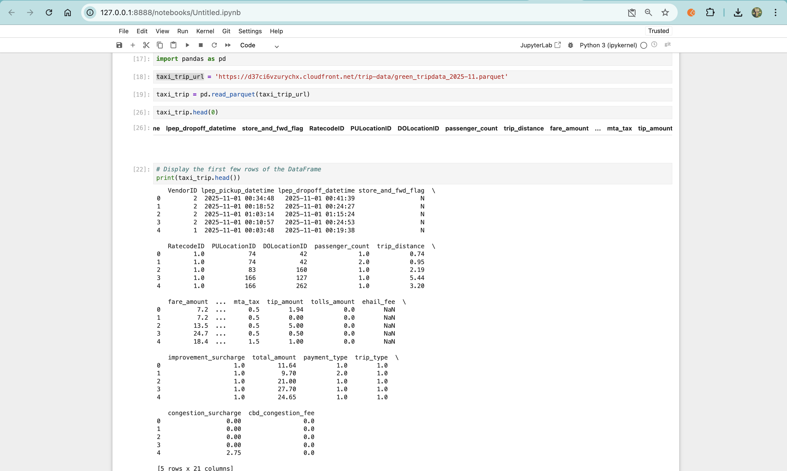
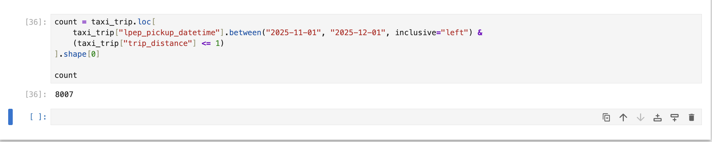
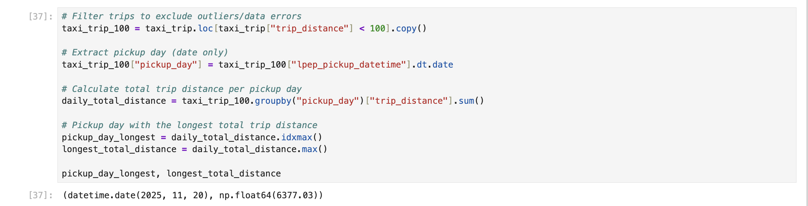
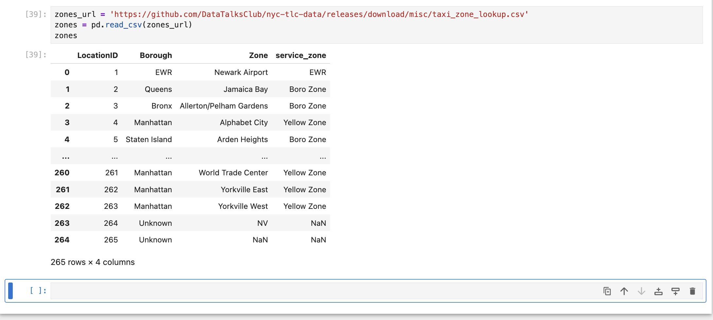
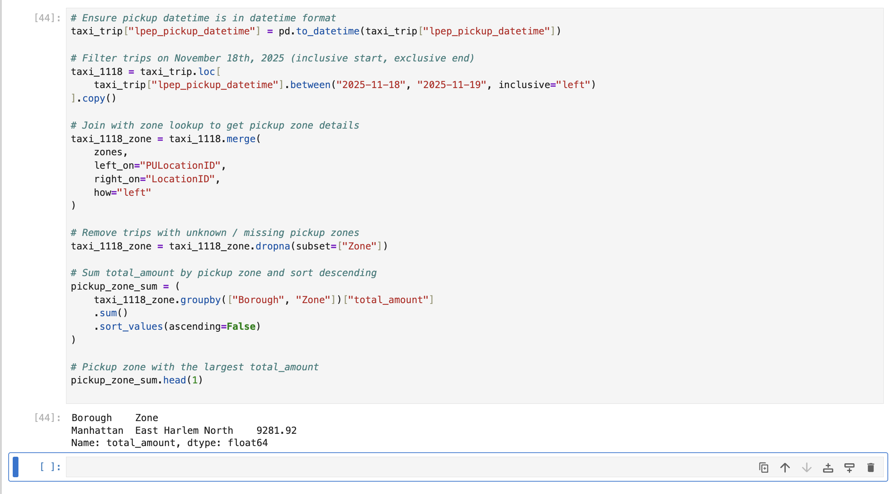
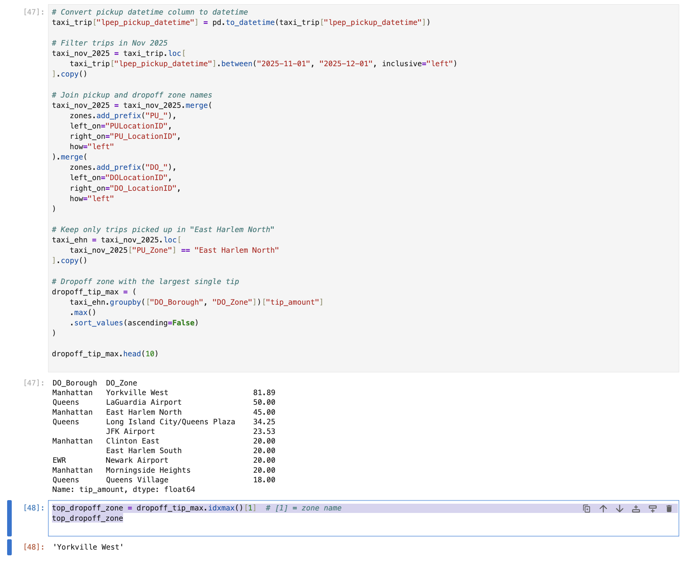

## Data
the green taxi trips data for November 2025:

https://d37ci6vzurychx.cloudfront.net/trip-data/green_tripdata_2025-11.parquet

the dataset with zones:

https://github.com/DataTalksClub/nyc-tlc-data/releases/download/misc/taxi_zone_lookup.csv

To find the answer, I used a Jupyter Notebook in GitHub Codespaces. 

I downloaded the dataset and tested the Parquet file directly in the notebook.

and run `uv run jupyter notebook`

### Q1: Counting short trips

For the trips in November 2025 (lpep_pickup_datetime between '2025-11-01' and '2025-12-01', exclusive of the upper bound), how many trips had a trip_distance of less than or equal to 1 mile?

 <br>

 <br>

### Notes (Approach)

This question can be solved using **filter + count**:

- **Filter (Date Range)**
  - Use `.between("2025-11-01", "2025-12-01", inclusive="left")` to select trips in **November 2025**.
  - `inclusive="left"` means:
    - include `2025-11-01`
    - exclude `2025-12-01` (upper bound)

- **Filter (Trip Distance)**
  - Keep only trips where `trip_distance <= 1` mile.

- **Count Rows**
  - Use `.shape[0]` to count how many rows (trips) match the conditions.


- The `.between()` method supports an `inclusive` option to control whether the start/end boundaries are included.  
  Here is the comparison:

| `inclusive` value | Start boundary included? | End boundary included? | Meaning (interval) | Sample interval (`start=10`, `end=20`) | Best use case |
|------------------|--------------------------|-------------------------|-------------------|----------------------------------------|--------------|
| `"both"`         | ✅ Yes                   | ✅ Yes                  | `[start, end]`    | Includes **10 ✅** and **20 ✅**         | Include both endpoints |
| `"left"`         | ✅ Yes                   | ❌ No                   | `[start, end)`    | Includes **10 ✅**, excludes **20 ❌**    | ✅ Best for month/date ranges (exclude upper bound) |
| `"right"`        | ❌ No                    | ✅ Yes                  | `(start, end]`    | Excludes **10 ❌**, includes **20 ✅**    | Exclude start, include end |
| `"neither"`      | ❌ No                    | ❌ No                   | `(start, end)`    | Excludes **10 ❌** and **20 ❌**         | Strict filtering (exclude both endpoints) |

### Q2: Longest trip for each day

To answer this question, we first exclude possible data errors by filtering out trips with `trip_distance >= 100`.  
Then, we group trips by pickup day and calculate the **total trip distance per day**.  
Finally, we use `idxmax()` to find the pickup day with the highest total distance.

```python
# Filter trips to exclude outliers/data errors
taxi_trip_100 = taxi_trip.loc[taxi_trip["trip_distance"] < 100].copy()

# Extract pickup day (date only)
taxi_trip_100["pickup_day"] = taxi_trip_100["lpep_pickup_datetime"].dt.date

# Calculate total trip distance per pickup day
daily_total_distance = taxi_trip_100.groupby("pickup_day")["trip_distance"].sum()

# Pickup day with the longest total trip distance
pickup_day_longest = daily_total_distance.idxmax()
longest_total_distance = daily_total_distance.max()

pickup_day_longest, longest_total_distance

# Pickup day with the longest total trip distance: pickup_day_longest

# Total trip distance on that day: longest_total_distance

### Notes 

`.copy()` forces Pandas to create a separate DataFrame in memory, so changes to `taxi_trip_100` will NOT affect the original `taxi_trip`.

taxi_trip_100 = taxi_trip.loc[taxi_trip["trip_distance"] < 100].copy()

#### (Approach)

This question can be solved using **filter + transform + groupby + sum + max**:

- **Filter (Remove Outliers)**
  - Only consider trips with `trip_distance < 100` to exclude data errors/outliers.

- **Transform (Extract Pickup Day)**
  - Create a new column `pickup_day` from `lpep_pickup_datetime`.
  - This keeps only the **date part** (day) so trips can be grouped per day.

- **GroupBy + Sum**
  - Group trips by `pickup_day`.
  - Sum `trip_distance` to calculate the **total trip distance per day**.

- **Max (Find the Top Day)**
  - Use `idxmax()` to find the pickup day with the **largest total trip distance**.
  - Use `max()` to get the **total distance value** for that day.

 <br>

## Q3: Biggest pickup zone

Which was the pickup zone with the largest total_amount (sum of all trips) on November 18th, 2025?

```python
# Ensure pickup datetime is in datetime format
taxi_trip["lpep_pickup_datetime"] = pd.to_datetime(taxi_trip["lpep_pickup_datetime"])

# Filter trips on November 18th, 2025 (inclusive start, exclusive end)
taxi_1118 = taxi_trip.loc[
    taxi_trip["lpep_pickup_datetime"].between("2025-11-18", "2025-11-19", inclusive="left")
].copy()

# Join with zone lookup to get pickup zone details
taxi_1118_zone = taxi_1118.merge(
    zones,
    left_on="PULocationID",
    right_on="LocationID",
    how="left"
)

# Remove trips with unknown / missing pickup zones
taxi_1118_zone = taxi_1118_zone.dropna(subset=["Zone"])

# Sum total_amount by pickup zone and sort descending
pickup_zone_sum = (
    taxi_1118_zone.groupby(["Borough", "Zone"])["total_amount"]
    .sum()
    .sort_values(ascending=False)
)

# Pickup zone with the largest total_amount
pickup_zone_sum.head(1)

### Notes (Approach)

This question can be solved using **filter + join + groupby + sum + sort**:

- **Filter (Date Range)**
  - We only want trips on **November 18th, 2025**.
  - Use `.between("2025-11-18", "2025-11-19", inclusive="left")` to include all trips on Nov 18, and exclude the upper bound (Nov 19).

- **Join (`merge`)**
  - The trip dataset only contains `PULocationID` (pickup location ID).
  - We **join** with the `zones` lookup table to translate the ID into real zone information such as:
    - `Borough`
    - `Zone`

- **Clean Missing Zones**
  - Some trips may not have a matching zone after the join.
  - Use `.dropna(subset=["Zone"])` to remove trips with unknown pickup zone names.

- **GroupBy + Sum**
  - Group trips by pickup zone (`Borough`, `Zone`)
  - Sum `total_amount` to calculate the **total revenue per pickup zone**.

- **Sort + Top Result**
  - Sort the total revenue in descending order.
  - The first row (`head(1)`) gives the pickup zone with the **largest total_amount**.

 <br>

 <br>

## Q4: Largest tip

For the passengers picked up in the zone named "East Harlem North" in November 2025, which was the drop off zone that had the largest tip?


```python 
# Convert pickup datetime column to datetime
taxi_trip["lpep_pickup_datetime"] = pd.to_datetime(taxi_trip["lpep_pickup_datetime"])

# Filter trips in Nov 2025
taxi_nov_2025 = taxi_trip.loc[
    taxi_trip["lpep_pickup_datetime"].between("2025-11-01", "2025-12-01", inclusive="left")
].copy()

# Join pickup and dropoff zone names
taxi_nov_2025 = taxi_nov_2025.merge(
    zones.add_prefix("PU_"),
    left_on="PULocationID",
    right_on="PU_LocationID",
    how="left"
).merge(
    zones.add_prefix("DO_"),
    left_on="DOLocationID",
    right_on="DO_LocationID",
    how="left"
)

# Keep only trips picked up in "East Harlem North"
taxi_ehn = taxi_nov_2025.loc[
    taxi_nov_2025["PU_Zone"] == "East Harlem North"
].copy()

# Dropoff zone with the largest single tip
dropoff_tip_max = (
    taxi_ehn.groupby(["DO_Borough", "DO_Zone"])["tip_amount"]
    .max()
    .sort_values(ascending=False)
)

dropoff_tip_max.head(10)

top_dropoff_zone = dropoff_tip_max.idxmax()[1]  # [1] = zone name
top_dropoff_zone

### Notes (Approach)

This question can be solved using **join + filter + groupby + max**:

- **Join (`merge`)**
  - The trip dataset only contains `PULocationID` and `DOLocationID`.
  - We **join** it with the `zones` lookup table so we can convert those IDs into real zone names (example: **East Harlem North**).

- **Filter**
  - Keep only trips in **November 2025**
  - Keep only trips where the **pickup zone = "East Harlem North"**

- **GroupBy**
  - Group trips by **dropoff zone** so we can compare tips for each destination zone.

- **Max**
  - The question says **largest tip** (singular), so we take the **maximum tip** (`tip_amount.max()`) for each dropoff zone.
  - Then we select the dropoff zone with the **highest max tip**.

 <br>