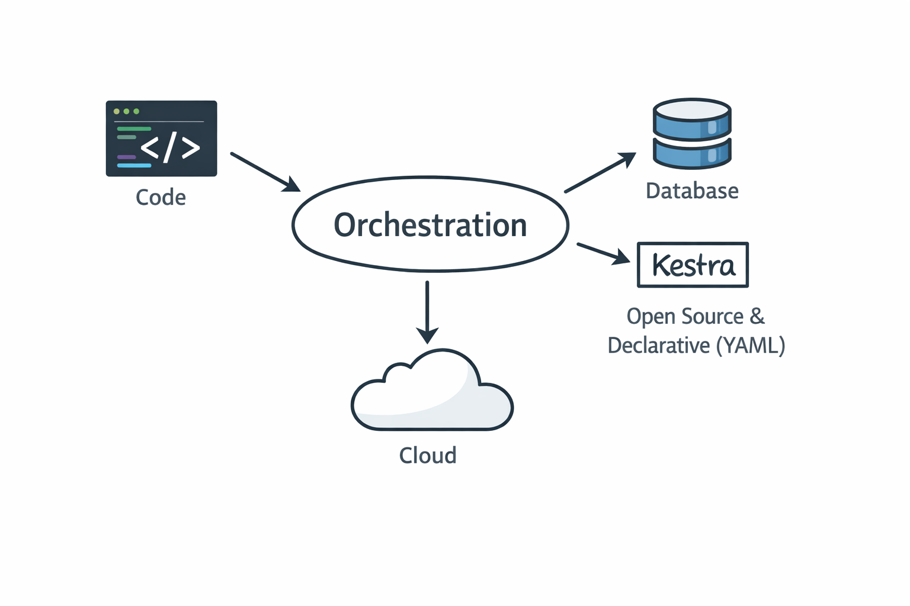

# Workflow Orchestration

In the previous module, I learned how to use Docker and docker-compose to build containerized data pipelines with PostgreSQL, networking, and persistent storage.

In this module, we will start developing the workflow orchestration using Kestra.  
We will reuse the existing `docker-compose.yaml` with some adjustments to support Kestra.

## Concept

In data engineering, workflow orchestration refers to the automation and coordination of tasks that 

process and move data across system. Instead of manually running jobs one-by one, orchestration 

ensure that:
- taks run in the right order
- dependencies between tasks are handled

this of orchestration as conductor of a data pipeline. 

Kestra position as workflow orchestration that can build workflow as code, on code or with AI.
 

## 📂 Module Resources

- 📝 Homework: https://github.com/rfnaufal/data-engineering/blob/main/02-workflow-orchestration/guide/99_homework.md
- 🛠 Working Directory: https://github.com/rfnaufal/data-engineering/tree/main/pipeline

---

## 🗒️ Guide and Notes

Personal technical notes for this module:

- [Dockerizing Kestra](guide/01_docker-kestra.md)  
- [Build First Workflow](guide/02_kestra-flow.md)  
- [Build Data Pipeline](guide/03_kestra_pipeline.md)  
- [Load Taxi Data to PostgreSQL](04_load-taxi-data-postgres.md)

