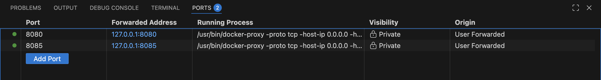

## Dockerizing Kestra

### Create Volumes for Postgres and Kestra

Navigate to the existing project directory

cd /workspaces/data-engineering/pipeline in the codespace and create two folders:
- kestra_postgres_data
- kestra_data

  

In the `docker-compose.yaml`, we will add a container for Kestra along with its configuration.

To do this, we need to replace the `docker-compose.yaml` from Module 2 in the working directory.  
Before that, I copied the previous `docker-compose.yaml` file into the `01-docker` folder.

#### Containerized kestra

run `docker compose up` command then monitor using `docker compose ps` 

to access from my laptop to codespace add port manually in this order:
1. add port 8085
2. then port 8080
  