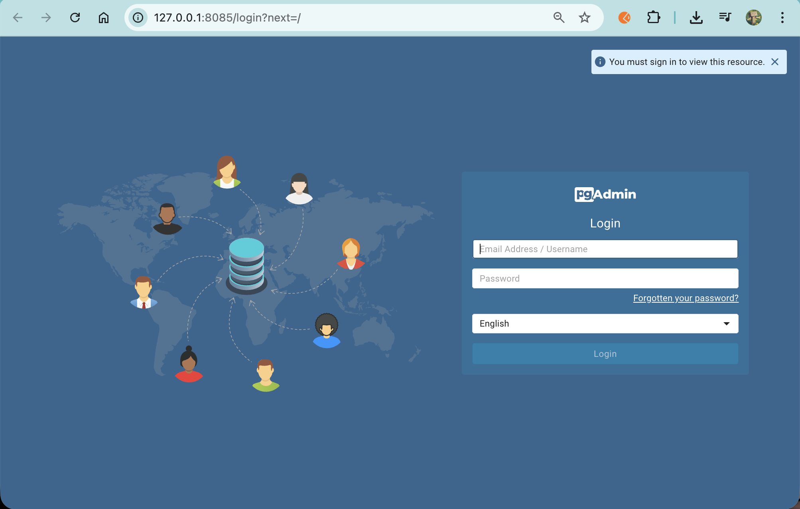
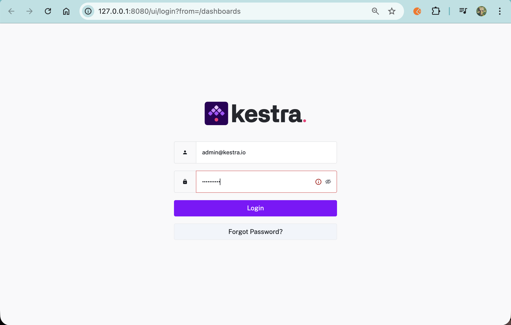

## Dockerizing Kestra

### Create Volumes for Postgres and Kestra

Navigate to the existing project directory

cd /workspaces/data-engineering/pipeline in the codespace and create two folders:
- kestra_postgres_data
- kestra_data

These directories will be used to persist data for Postgres and Kestra.

### Update docker-compose.yaml

Next, we will add a Kestra container along with its required configuration.

To do this, replace the docker-compose.yaml file in the working directory with the updated version.
(For reference, the previous docker-compose.yaml from Module 2 has been moved to the 01-docker folder.)

### Run Kestra in Containers

Start the services:
`docker compose up`

Verify that the containers are running:
`docker compose ps`

### Expose Ports in Codespaces

To access Kestra from your local browser, manually forward the following ports in Codespaces:

- 8085 — Kestra UI
- 8080 — Kestra API

Here is the dahsboard:

