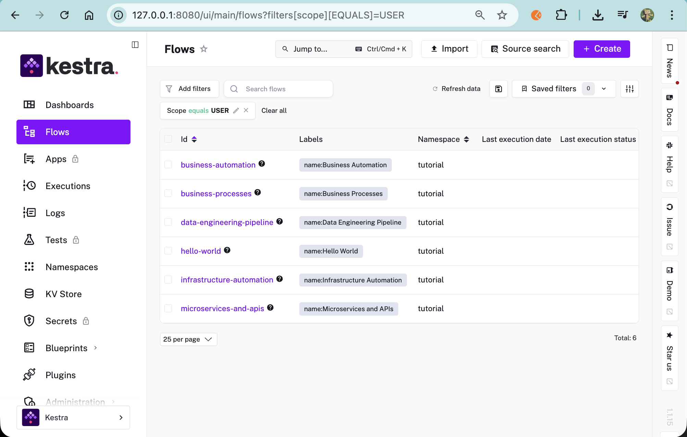
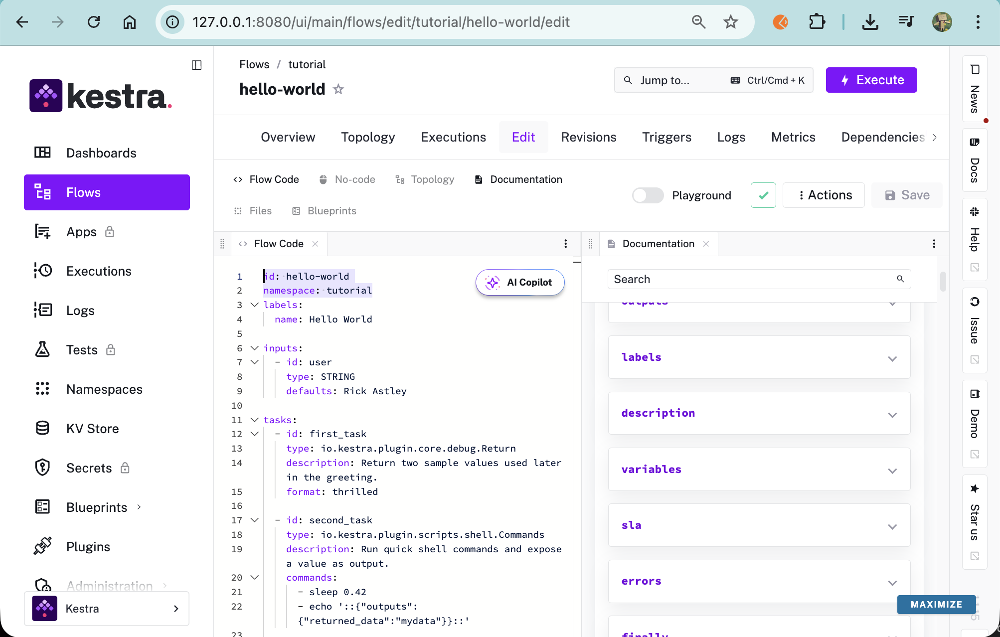
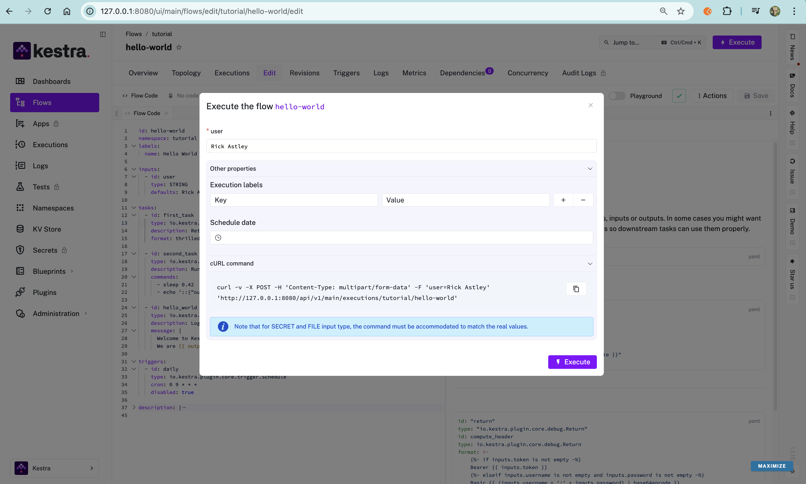
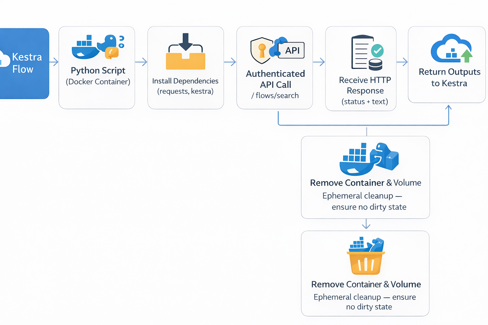
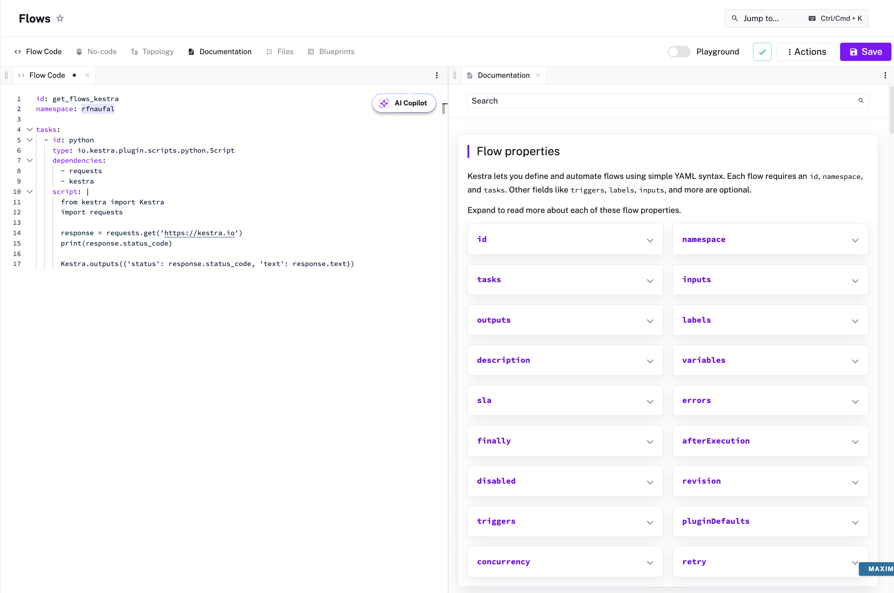
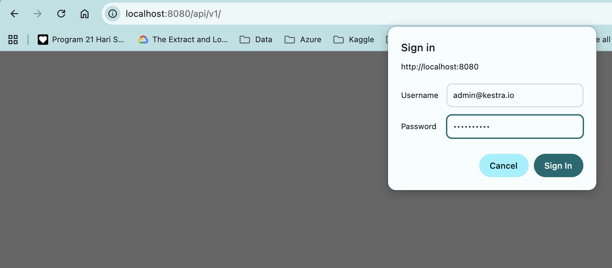

## Kestra

### Concept

Before building any workflows, let’s briefly understand how Kestra organizes automation.

In Kestra, everything is built around the idea of **flows**.

Flows are defined using simple YAML syntax. At a minimum, each flow needs an `id`, a `namespace`, and a list of `tasks`. 
Once a flow is saved, its `namespace` and `id` cannot be changed.

However, task IDs can be updated if needed.

Other fields like triggers, labels, inputs, and outputs are optional, depending on how advanced your workflow needs to be.



A flow represents an end-to-end workflow composed of:

- **tasks** — what gets executed  
- **triggers** — when it runs  
- **dependencies** — execution order and conditions  
- **inputs** — parameters passed into the flow  
- **outputs** — data produced and shared between tasks  

Once you understand flows, building orchestration becomes much easier.

---

### Creating Workflows (Flows)

Now that we understand the core concept, let’s use our first workflow.

Kestra already provides a sample flow in the Flow Dashboard, which we’ll use to explore how flows work in practice.

In general, workflows can be created either through the UI or programmatically via Kestra’s API using POST requests, which is more suitable for real production and automation.

---

### Exploring the Hello-World Flow

The [`01_hello_world.yaml`](https://github.com/rfnaufal/data-engineering/blob/main/02-workflow-orchestration/flows/01_hello_world.yaml) flow brings all of these concepts together in these example.

Here’s what this workflow includes:

- Five tasks in total: three log tasks and one sleep task  
- An input called `name`  
- A variable that uses the `name` input to generate a full welcome message  
- An output created from the return task and logged in a later log task  
- A trigger that runs the flow every day at 10 AM  
- Plugin defaults that send all log messages at the `ERROR` level  
- A concurrency limit of two executions — any additional runs while two are active will fail




Based on the sample flow, each task includes its own set of properties, along with explanations and examples.

When we execute the workflow, Kestra will prompt for the `name` input, using the default value we defined.



---

### Orchestrate Python Code (My First Workflow)

#### Calling Kestra API from a Python Flow (Codespaces Setup)

Here is the provided YAML file used to execute a Python script:  
[`02_python.yaml`](https://github.com/rfnaufal/data-engineering/blob/main/02-workflow-orchestration/flows/02_python.yaml)

This example comes from the Zoomcamp material. this the high level flow as it is:


For my own experiment, I wanted to try a different use case — retrieving the list of flows using Kestra’s API.


---

**How I Did It**

**1. Copy the example flow**

Copy **“Execute a Python script and generate an output”** from the left panel when editing `02_python.yaml`.


---

**2. Create a new flow**

Paste it into a new flow and modify the `id` and `namespace`.



---

**3. Find the API endpoint**

From Kestra API documentation:

https://kestra.io/docs/api-reference/open-source#get-/api/v1/-tenant-/flows/search

---

**4. Test API directly in browser**

Access locally:

http://localhost:8080/api/v1/flows/search




This works because my laptop browser connects to the forwarded Codespaces port.

### 5. Call the API inside a flow

I created this flow:

[`02_python-get-flows.yaml`](https://github.com/rfnaufal/data-engineering/blob/main/02-workflow-orchestration/flows/02_python-get-flows.yaml)

This flow uses a Python script to send a GET request to the Kestra API.


---

**Note: Networking in GitHub Codespaces**

> I access Kestra UI from my **laptop browser**, while Kestra itself runs inside **Docker Compose in GitHub Codespaces**.

Flow execution uses the **Docker task runner**, which launches each task in a separate container.

Inside those containers:

- `localhost` refers to the task container itself
- Docker Compose service names (e.g. `kestra`) are not reachable
- The Codespaces VM host must be accessed explicitly

---

** Solution: Use `host.docker.internal`**

Flow configuration:

```yaml
taskRunner:
  type: io.kestra.plugin.scripts.runner.docker.Docker
  extraHosts:
    - "host.docker.internal:host-gateway"


