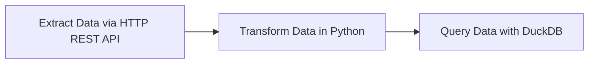
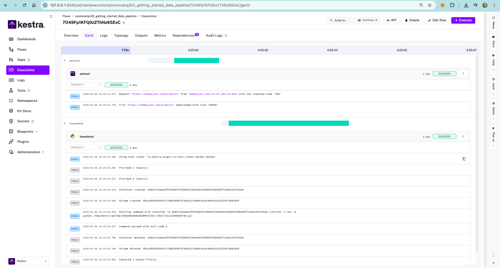
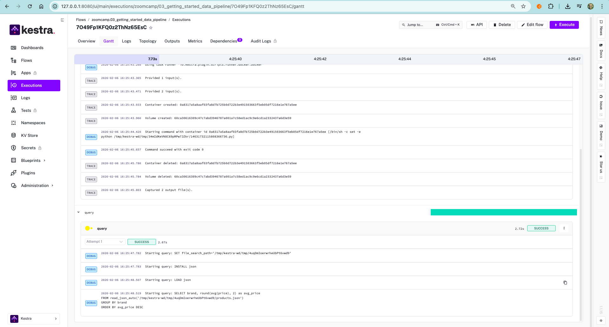
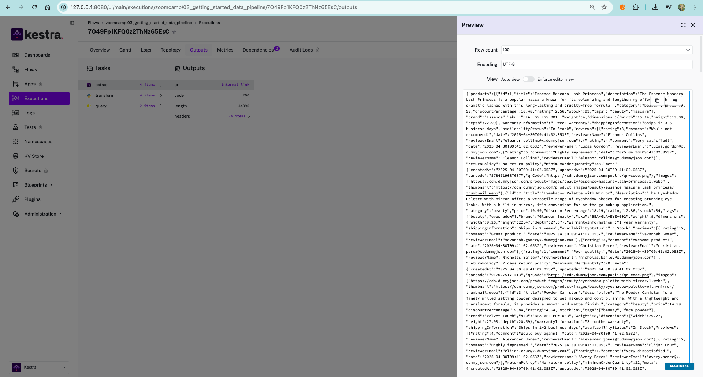
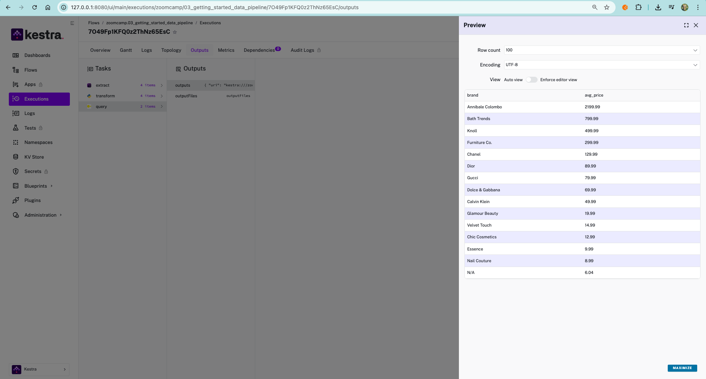

## Build Data Pipeline Kestra

### Preparation
We will use [`03_getting_started_data_pipeline`](https://github.com/rfnaufal/data-engineering/blob/main/02-workflow-orchestration/flows/03_getting_started_data_pipeline.yaml) to build our first pipeline.

## Pipeline

here is the ETL process within the pipeline. as input we choose the columns (brand, price).


there are 3 taskId :


1. Extract 
    Download raw products JSON
2. Tranform
    Python filters it into products.json
    
3. Query
    DuckDB computes average price per brand and stores the result
    
    the actual query:
    ```sql
    SELECT brand, round(avg(price), 2) as avg_price
    FROM read_json_auto('{{workingDir}}/products.json')
    GROUP BY brand
    ORDER BY avg_price DESC;
    ```

    Translation:

    - read your products.json
    - group by brand
    - compute average price
    - sort from highest avg price to lowest
    
    So the end product is basically:

    “Which brands are expensive on average?”

    with `fetchType: STORE` means it's store the result.

    here are the outputs:

         <br>
         <br>
         <br>
         <br>


