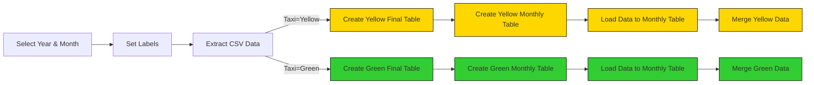

## Load Data Taxi to PostgreSQL(Local Database)

### Preparation
We will use the flow file [`04_postgres_taxi.yaml`](https://github.com/rfnaufal/data-engineering/blob/main/02-workflow-orchestration/flows/04_postgres_taxi.yaml) to process the Yellow and Green Taxi datasets using a local PostgreSQL database running inside a Docker container.

This setup reuses the same database from Module 1, which is defined in the same Docker Compose file as Kestra.

The workflow performs the following steps:

- Extracts CSV data partitioned by year and month
- Creates the required tables
- Loads data into monthly staging tables
- Merges the monthly data into the final destination tables

      

