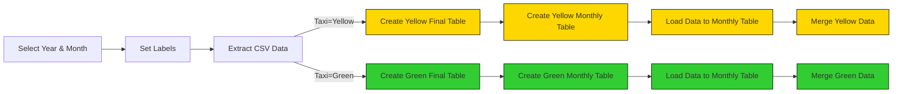
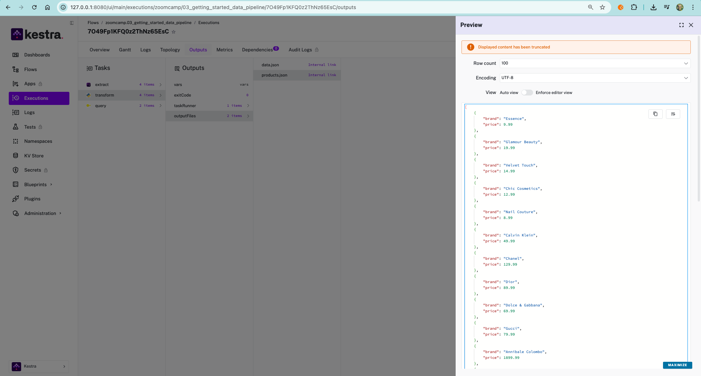

## Load Data Taxi to PostgreSQL(Local DB)

### Preparation
We will use [`04_postgres_taxi.yaml`](https://github.com/rfnaufal/data-engineering/blob/main/02-workflow-orchestration/flows/04_postgres_taxi.yaml) to play with the Yellow and Green Taxi data using a local Postgres database running in a Docker container. We will use the same database from Module 1 which should be in the same Docker Compose file as Kestra.

The flow will extract CSV data partitioned by year and month, create tables, load data to the monthly table, and finally merge the data to the final destination table.

      

