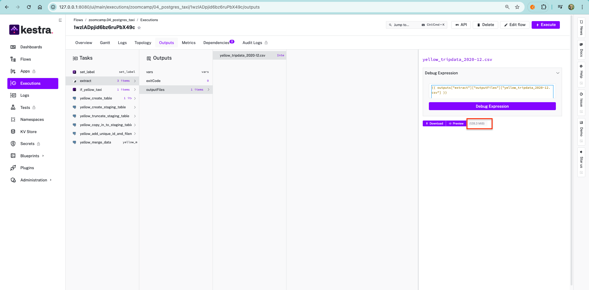
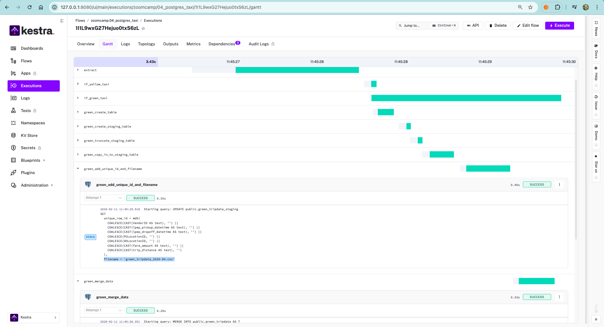

## Data

the green taxi trips data for 2019-2020:

https://github.com/DataTalksClub/nyc-tlc-data/releases/tag/green/download


**Q1: Within the execution for Yellow Taxi data for the year 2020 and month 12: what is the uncompressed file size (i.e. the output file yellow_tripdata_2020-12.csv of the extract task)?**

 <br>


**Q2: What is the rendered value of the variable file when the inputs taxi is set to green, year is set to 2020, and month is set to 04 during execution?**

 <br>


## Q3: How many rows are there for the Yellow Taxi data for all CSV files in the year 2020?

Which was the pickup zone with the largest total_amount (sum of all trips) on November 18th, 2025?

```python
# Ensure pickup datetime is in datetime format
taxi_trip["lpep_pickup_datetime"] = pd.to_datetime(taxi_trip["lpep_pickup_datetime"])

# Filter trips on November 18th, 2025 (inclusive start, exclusive end)
taxi_1118 = taxi_trip.loc[
    taxi_trip["lpep_pickup_datetime"].between("2025-11-18", "2025-11-19", inclusive="left")
].copy()

# Join with zone lookup to get pickup zone details
taxi_1118_zone = taxi_1118.merge(
    zones,
    left_on="PULocationID",
    right_on="LocationID",
    how="left"
)

# Remove trips with unknown / missing pickup zones
taxi_1118_zone = taxi_1118_zone.dropna(subset=["Zone"])

# Sum total_amount by pickup zone and sort descending
pickup_zone_sum = (
    taxi_1118_zone.groupby(["Borough", "Zone"])["total_amount"]
    .sum()
    .sort_values(ascending=False)
)

# Pickup zone with the largest total_amount
pickup_zone_sum.head(1)
```

### Notes (Approach)

This question can be solved using **filter + join + groupby + sum + sort**:

- **Filter (Date Range)**

   - We only want trips on **November 18th, 2025**.
   - Use `.between("2025-11-18", "2025-11-19", inclusive="left")` to include all trips on Nov 18, and exclude the upper bound (Nov 19).

- **Join (`merge`)**

   - The trip dataset only contains `PULocationID` (pickup location ID).
   - We **join** with the `zones` lookup table to translate the ID into real zone information such as:
      - `Borough`
      - `Zone`

- **Clean Missing Zones**

   - Some trips may not have a matching zone after the join.
   - Use `.dropna(subset=["Zone"])` to remove trips with unknown pickup zone names.

- **GroupBy + Sum**

   - Group trips by pickup zone (`Borough`, `Zone`)
   - Sum `total_amount` to calculate the __total revenue per pickup zone__.

- **Sort + Top Result**

   - Sort the total revenue in descending order.
   - The first row (`head(1)`) gives the pickup zone with the __largest total_amount__.

 <br>

 <br>

## Q4: Largest tip

For the passengers picked up in the zone named "East Harlem North" in November 2025, which was the drop off zone that had the largest tip?

```python
# Convert pickup datetime column to datetime
taxi_trip["lpep_pickup_datetime"] = pd.to_datetime(taxi_trip["lpep_pickup_datetime"])

# Filter trips in Nov 2025
taxi_nov_2025 = taxi_trip.loc[
    taxi_trip["lpep_pickup_datetime"].between("2025-11-01", "2025-12-01", inclusive="left")
].copy()

# Join pickup and dropoff zone names
taxi_nov_2025 = taxi_nov_2025.merge(
    zones.add_prefix("PU_"),
    left_on="PULocationID",
    right_on="PU_LocationID",
    how="left"
).merge(
    zones.add_prefix("DO_"),
    left_on="DOLocationID",
    right_on="DO_LocationID",
    how="left"
)

# Keep only trips picked up in "East Harlem North"
taxi_ehn = taxi_nov_2025.loc[
    taxi_nov_2025["PU_Zone"] == "East Harlem North"
].copy()

# Dropoff zone with the largest single tip
dropoff_tip_max = (
    taxi_ehn.groupby(["DO_Borough", "DO_Zone"])["tip_amount"]
    .max()
    .sort_values(ascending=False)
)

dropoff_tip_max.head(10)

top_dropoff_zone = dropoff_tip_max.idxmax()[1]  # [1] = zone name
top_dropoff_zone
```

### Notes (Approach)

This question can be solved using **join + filter + groupby + max**:

- **Join (`merge`)**

   - The trip dataset only contains `PULocationID` and `DOLocationID`.
   - We **join** it with the `zones` lookup table so we can convert those IDs into real zone names (example: **East Harlem North**).

- **Filter**

   - Keep only trips in **November 2025**
   - Keep only trips where the **pickup zone = "East Harlem North"**

- **GroupBy**

   - Group trips by **dropoff zone** so we can compare tips for each destination zone.

- **Max**

   - The question says __largest tip__ (singular), so we take the __maximum tip__ (`tip_amount.max()`) for each dropoff zone.
   - Then we select the dropoff zone with the **highest max tip**.

 <br>