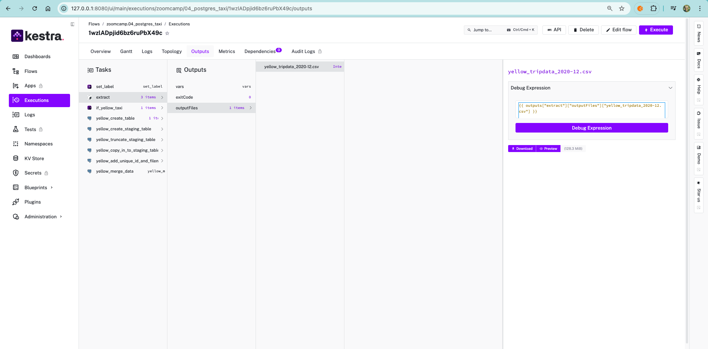
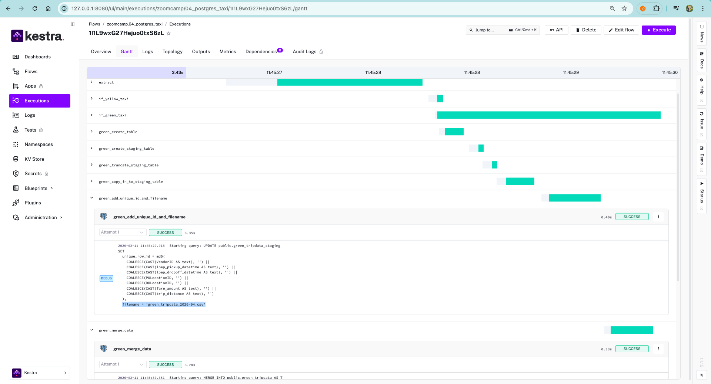
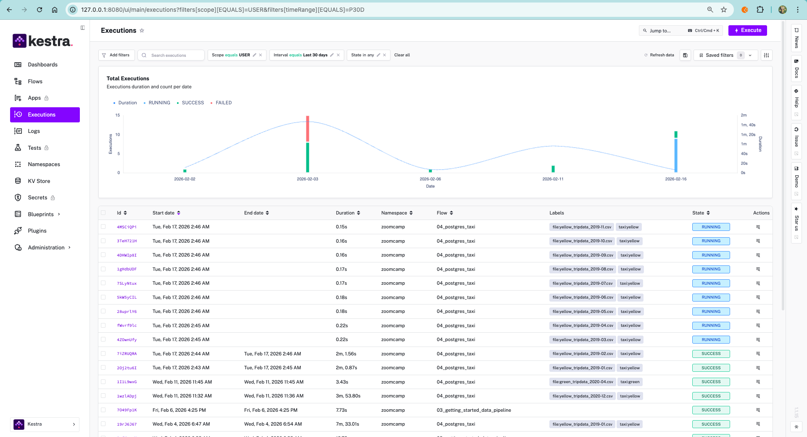

## Data

the green taxi trips data for 2019-2020:

https://github.com/DataTalksClub/nyc-tlc-data/releases/tag/green/download

**Q1: Within the execution for Yellow Taxi data for the year 2020 and month 12: what is the uncompressed file size (i.e. the output file yellow_tripdata_2020-12.csv of the extract task)?**
`answer: 128.3 MiB`

  

**Q2: What is the rendered value of the variable file when the inputs taxi is set to green, year is set to 2020, and month is set to 04 during execution?**
`answer: green_tripdata_2020-04.csv`

  

**Q3: How many rows are there for the Yellow Taxi data for all CSV files in the year 2020?**

To get the answer I executed multiple pipeline for all months in year 2020 however I found issue `The CSRF session token is missing. You need to refresh the page.`

then I tried the following:
1. open in incognito
2. docker compose down then bring up again still failed

the issue still exist. there are lots of solution but still not works. so in this case i didnt submit the homework. 

`answer: `

  

  

**Q4: How many rows are there for the Green Taxi data for all CSV files in the year 2020?**
  

**Q5: How many rows are there for the Yellow Taxi data for the March 2021 CSV file?**
  

**Q6: How would you configure the timezone to New York in a Schedule trigger?**
  